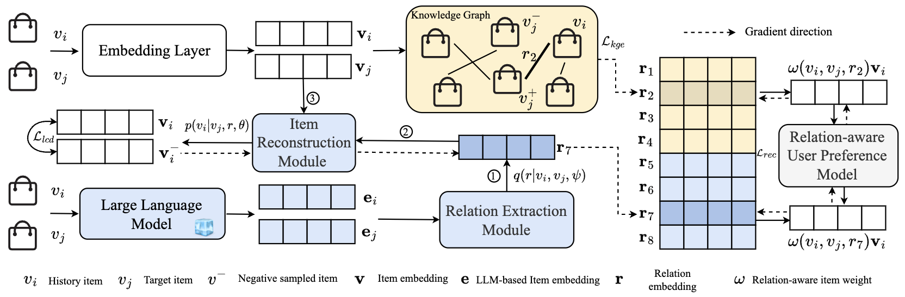

# LRD

This is the official implementation for *Sequential Recommendation with Latent Relations based on Large Language Model*

<div align=center>

</div>

## Getting Started

1. Install [Anaconda](https://docs.conda.io/en/latest/miniconda.html) with Python >= 3.5
2. Clone the repository and install requirements

```bash
git clone https://anonymous.4open.science/r/LRD-77C6
```

3. Install requirements and step into the `src` folder

```bash
cd LRD
pip install -r requirements.txt
cd src
```

4. Run model on the build-in dataset

```bash
python main.py --model_name KDAPlus --emb_size 64 --include_attr 1 --include_val 1 --freq_rand 1 --lr 1e-3 --l2 1e-6 --num_heads 4 --num_layers 5 --gamma -1 --history_max 20 --dataset Office --include_lrd 1 --epoch 200 --gpu 0